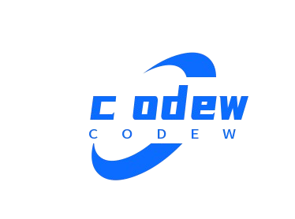

## 专业名词大全🥇


欢迎访问 **专业名词大全**😲，一个致力于收集和整理各个领域内各种专业术语的在线知识库
我的目标是打造一个全面、准确且易于理解的词汇表，帮助快速掌握某领域相关的术语含义
立刻开始💐探索词汇表

 
### 本地部署
如果您想在本地运行此项目，您可以按照以下步骤操作：

1. **安装依赖，运行后端**：
   ```bash
   cd coding-words/back
   npm install
   npm start
   ```
2. **导入数据库**：
   ```bash
   mysql -u root -p
   source coding-words/data/sql/codeword_user_2026-03-11_224355.sql;
   source coding-words/data/sql/codeword_word_2026-03-11_224430.sql;
   ```
   项目将在codeword/font/index.html运行

### 运行


### 贡献指南🥈
我非常欢迎社区成员对项目做出贡献！您的参与将使这个知识库更加完善和丰富
1. **注册登录账号**：请先注册一个账号，然后登录
1. **提交新词条**：登录后，点击页面右上角的`提交新词条`按钮，填写词条名称、定义、示例、相关链接等信息，提交后等待审核。
2. **校正与更新**：如果发现已有的词条描述存在错误或过时，也请通过`Issue`提交修改建议。
3. **文件格式**: 使用`Markdown (.md) 格式`编写词条。 - 每个词条应该包含：`词条名称`、`定义`、`示例`、`相关链接`等信息。

### 联系我们🥉
如果您有任何问题、建议或反馈，欢迎通过以下方式联系我： - 邮箱：`liheng2137@126.com`
感谢所有贡献者和维护者的辛勤工作，是你们让这个项目变得更好！

### 许可协议
本项目采用`MIT`许可证，详情参见`LICENSE文件`。
这意味着您可以自由地使用、复制、修改和分发此项目下的代码和资源，但需保留原作者的版权声明

### 声明 

`专业名词大全 © [2024]，由liheng维护`
尽管我努力确保信息的准确性，但我不对任何因使用或依赖此网站上的信息而导致的损失或损害承担责任
我们期待您的加入，一起构建更完善的词汇表！🛄


### bug
1. 富文本怎么渲染出来啊  2026-3-11  solved

2. word_name的text内容有html标签渲染时会把标签也渲染出来   2026-3-12  solved

3. 更多功能和搜索结果页面的分页  2026-3-13  not solved

4. 部署到无服务器  2026-3-13  not solved

5. Github登录实现 头像功能要实现 2026-3-13  not solved

